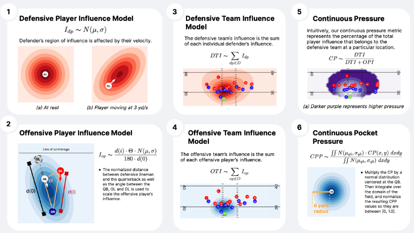
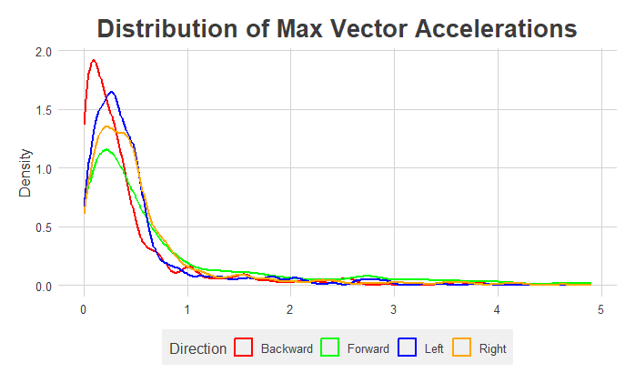
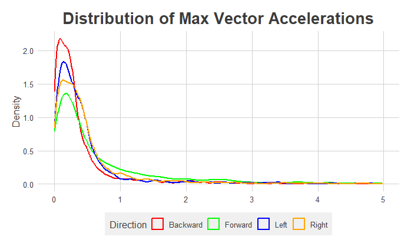

```{r, load_refs, include=FALSE, cache=FALSE}
library(RefManageR)
library(tidyverse)
```


class: title-slide   

<br><br><br>

# Calculating Vector Accelerations Using American Football GPS Data

## ECON 5253 Final Project

### Steven Plaisance

### University of Oklahoma

---
# Introduction

- American Football GPS Data

    - Provides raw positional data for each athlete
    - Sampled at 10 Hz (10 obervations per second)
    - Currently used primarily to monitor workload and performance indicators
    - The NFL is working to bridge the gap between GPS data and football analytics (Big Data Bowl)
      - Possible applications include In-game decision-making, roster construction and draft analytics

- Vector Accelerations 

    - The data includes scalar acceleration, so magnitude without respect to the direction of movement.
    - Goal: calculate acceleration vectors with respect to the athlete's orientation and movement.
     - Find propulsion (positive acceleration) and braking (negative acceleration) in each of the four directions
       - Forward, Backward, Left and Right
    - This approach provides more individualized insights

---
# Data

- The raw data includes the following variables sampled at 10Hz

    - athlete_id: A uid describing the athlete being recorded
    - stream_type: Specifies whether the data was recorded via satellite positioning or local positioning
    - x: field x coordinates (meters)
    - y: field y coordinates (meters)
    - ts: POSIX time in seconds since the start of the epoch
    - cs: Observation time offset in centiseconds
    - face: the magnetic facing of the unit (degrees)
    - v: velocity (meters per second)
    - a: acceleration (meters per second per second)
    - pq: positional quality (percentage)
    
---
# Data (cont.)

.center[
```{r img1, echo=F, out.width="75%"}

```

Source: Hassan Inayali, Aaron White, and Daniel Hocevar, NFL Big Data Bowl 2023
]

    

---
# Methods

- Our vectors will be based on the difference between the direction the athlete is facing (face) and the direction they are moving.

    - First we must calculate a new variable alpha, which represents the direction the athlete is moving. 
      - Done via the two-argument arctangent function, using instaneous change in x and y coordinates as the arguments
    - Next we calculate a new variable theta, the difference between face and alpha.
    - Now use theta to calculate a series of helper variables signaling what proportion of the current movement is in each of the four planes
      - Theta = 0 degrees would be 100% forward
      - Theta = 45 degrees would be 50% forward, 50% right, etc.
    - Simply multiply the helper variables by scalar acceleration to find local vectors.
    
- These local vectors can now be used in place of the scalar accelerations in pre-existing GPS summaries

---
# Results (Running Back)

.center[
```{r img2, echo=F, out.width="85%"}

```
]

---
# Results (Cornerback)

.center[
```{r img3, echo=F, out.width="85%"}

```
]

---
# Discussion

By creating more specific acceleration vectors, we expand the analysis possibilities, both in terms of physical performance and in-game production. Some possible next steps:

- Physical Performance

    - Monitor specific acceleration patterns of a rehab athlete based on their injury 
    - Monitor performance changes in different directions based on position groups
    - Research relationship between chronic overuse in one direction and subsequent injury
    - Research relationship between different training programs and long-term performance changes

- In-Game Production

    - Identify athletes' strengths and weaknesses in various movement types to better inform scheme and personnel decision-making
      - Which running backs and receivers cut faster toward their left/right?
      - Which defensive backs excel at backpedaling vs. forward propulion? (Corner vs. Safety)
    - Using NFL data, research relationship between various movement types and long-term NFL success.
